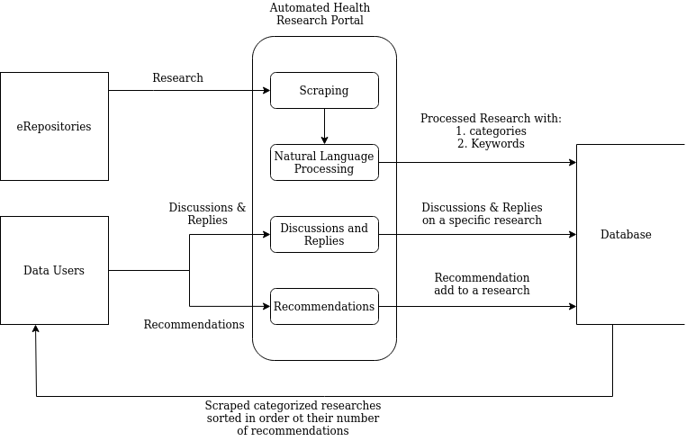

INTRODUCTION
============

BACKGROUND
~~~~~~~~~~
Automated Health Research Portal, is a project that will be based on the 
concept of **Knowledge Translation**. The Canadian Institutes of Health Research 
(CIHR) in 2000, defined Knowledge Translation as:

    *[The] exchange, synthesis and ethically-sound application of knowledge—within 
    a complex system of interactions among researchers and users—to accelerate the 
    capture of the benefits of research for Canadians through improved health, more 
    effective services and products, and a strengthened health care system.*

Though the definition is focused on the Canadians, 
its concepts, models and applications can be applied in any other part of the world.

The origin of Knowledge Translation related activities dates back to the 1910s to 
address the underutilization of scientific findings in the health sector. 
Keeping up with information in real-time was one of the major issues that was being 
addressed. This underutilization of healthcare related research has remain unsolved 
until current decades. Grimshaw et al. state that, despite billions of dollars each 
year spent in both public and private sectors on education and research in health and 
medicine, the healthcare system has failed to bring cost-effective services to a portion 
of those who need them. Grimshaw et al. hold the belief that people fail to benefit 
optimally from scientific and medical advances.

As a result of this, research has been done on how to improve the utilization of 
research and many tools have been put forward to do that. One of the proposed tools is 
Knowledge Translation. Knowledge Translation activities include: transferring of research 
findings to healthcare providers, such as doctors, who then apply the knowledge to 
healthcare consumers who are the patients. In a broader sense, this research finding can 
be used by policy makers to implement rational policies that have been backed by credible 
research.

Knowledge Translation has gained a lot of traction over the years. International organizations 
such as the World Health Organisation have encouraged and sponsored its implementation. 
In countries like Iran their Ministry of Health and Medical Education and major universities 
have taken up the challenge and supported any implementation put forward on Knowledge Translation.

**Take a look at the following scenarios:**

    #) It's a busy day in your office, and you are running behind schedule. Your patient with 
       arthritis of the knee greets you with a small stack of printouts from the Internet on 
       glucosamine. She wants to know whether taking this medicine would be beneficial.

    #) You're in the emergency department, managing a patient with unstable angina. 
       You wonder whether the current evidence would support combining a glycoprotein 
       IIb/IIIa inhibitor with low-molecular-weight heparin in this case.
       From the above scenarios we can conclude that it is important for doctors to 
       find reliable research that has been used, proven and reviewed by other doctors 
       in near real-time to help their patients.

This project is a technology-based implementation of the concepts of Knowledge Translation 
that will address the underutilization of the extensive and intensive research done in the 
health sector by mining health researches from a wide range of online sources, sorting them out
and put them in easily identifiable categories. I will be collaborating with Professor Peter Wagacha Waiganjo.

PROBLEM STATEMENT
~~~~~~~~~~~~~~~~~
Over the years, there has been an exponential growth in the number of research done in the 
healthcare sector. These research is extensive and intensive and is focused on the various 
fields and diseases in the industry. However, despite all the available research there has 
been major issues connected to the ineffective healthcare system such as:

    * Ineffective continuing education for health professionals.
    * Increasing complexity of medical procedures and treatments.
    * Inadequate application of evidence to case management.
    * Lack of adequate communication between researchers and policy makers.
    * Physicians are faced with a rapid and voluminous accumulation of new findings, 
      making it increasingly difficult to follow current knowledge and integrate it into practice.

OBJECTIVES
~~~~~~~~~~
This project’s objectives are based on two broad topics:

    #) RESEARCH OBJECTIVES

       * Research on the topic of Knowledge Translation.
       * Research on the application of knowledge based systems in the field of Knowledge Translation.
       * Research on credible sources of researches.
       * Research on how researches in the medical field are reviewed.

    #) SYSTEM DEVELOPMENT OBJECTIVES

       * To dig for the requirements and analyse them keenly.
       * To carry out system analysis and design activities 
       * using the various available tools such as Data Flow Diagrams.
       * To test, implement and document:

            * a relational database to store the information - Postgresql.
            * web scraper to automate the collection of researches - BeautifulSoup 
            * Full-Text Search to index the information for fast and accurate search results
            * a review mechanism for users to review information based on its usefulness and applicability.

RESEARCH TOPICS
~~~~~~~~~~~~~~~
The first research topic will be on Knowledge Translation. This research will help understand the 
procedures followed in writing and publishing of research in the health sector that will be useful 
in designing the web scraper. Understanding in depth the concept, model and origin of Knowledge 
Translation will be one of the goals of this research. This will give a broader understanding of 
the concept and its barriers and the various solutions made over the years with regard to this topic. 
Moreover, knowledge in this field has over the years gotten attention by global organisations such as 
the World Health Organisation (WHO).

The second research topic will be on the application of knowledge based systems in Knowledge 
Translation. The research will be aimed at finding out if any, a knowledge-based system that has 
implemented this. The research will look at how best to store this knowledge taking into 
considerations the standards that have been set in this field. Identifying and learning the 
shortcomings of the said implementation and how best to overcome them and exploration on any other 
feasible implementation available will be part of the goals of this research.

The third research toopic is to identify credible sources of health research data from the internet.
This will enable the project to fetch researches that are deemed relevant, useful and trusted by 
experts in the medical field.

The fourth, and last research topic is to understand how research reviewers review health publications
in order to create a smart review module for the users of this system. This involves looking at experts
checklists and integrating them with the system.

PROJECT JUSTIFICATION
~~~~~~~~~~~~~~~~~~~~~
The project will build a bridge the gap between researchers and users of these researches - medical practitioners, 
patients, researchers and policy makers. By translating knowledge and bringing it closer to them, 
they will be able to utilise the credible research available to improve the health care system and benefit all the players.

LITERATURE REVIEW
=================

The literature review is presented in serveral subsections namely: the concept of digital preservation and 
institutional repositories; concepts and keywords used in disease categorization and metrics of reviewing health researches.

THE CONCEPT OF DIGITAL PRESERVATION AND INSTITUTIONAL REPOSITORIES
~~~~~~~~~~~~~~~~~~~~~~~~~~~~~~~~~~~~~~~~~~~~~~~~~~~~~~~~~~~~~~~~~~
Over the recent years the world has seen an increase in Digital Preservation. Digital preservation refers 
to the overall approach to preserving information and appraisal of digital information over its entire 
life cycle. There has been a growing awareness of the importance of digital preservation that has led 
to the development of many approaches that deal with the said topic. Some examples of approaches 
developed are migration and emulation. Migration is where by an object is transformed into widely 
accessible representations. Emulation is where by a technical environment is created where objects can 
be rendered or performed.Kenya, despite the many challenges in digital preservation, has made strides 
towards the right direction with a lot of digital preservation present in most Kenyan universities.

Digital preservation leads to digital repositories. Digital repositories are information systems that 
ingest, store, manage, preserve and provide access to digital content. There are several types of digital 
repositories such as: institutional, discplinary, government and centralized repositories. The scope of 
this project focuses on institutional repositories which have several purposes - they support 
scholary communication and provide open access to articles, dissertations and research data and provide 
platforms for storing and preserving the digital master files created as a result of digitization projects.

Most IRs in Kenya are owned by universities. These include University of Nairobi, Kenyatta University, 
Jomo Kenyatta University of Agriculture and Technology, Moi University, Egerton University, Maseno University,
the Technical University of Kenya among other universities. Of all the universities in Kenya, UoN, KU, SU, PU,
JKUAT and DeKUT are some of the universities who've had their IRs listed in the worldwide directory of IRs. As 
such they provide a good candidates of research information to be utilised by this project. UoN, moreover, has 
the largest repository in terms of the total item count. Therefore, it provides adequate research information on
various topics include health research. Other universities IRs will work as supplimentary sources.

With the growth in digital preservation, comes the need to make use of all these information. There
has been many attempts and tools brought forward to help people utilize these information for better
decision making and living standards. Some of them include *data mining* and *natural language processing*. 
Data mining is defined as the practice of examining large pre-existing databases in order to generate new 
information. NaturalLanguage Processing is a subfield of linguistics, computer science, information engineering, 
and artificial intelligence concerned with the interactions between computers and human languages, in 
particular how to program computers to process and analyze large amounts of natural language data.

CONCEPTS AND KEYWORDS USED IN DISEASES CATEGORIZATION
~~~~~~~~~~~~~~~~~~~~~~~~~~~~~~~~~~~~~~~~~~~~~~~~~~~~~
Researches have been categorized based on the diseases they address. These categories follow ICD-10 guidelines.
ICD is the foundation for the identification of health trends and statistics globally, and the international 
standard for reporting diseases and health conditions. It is the diagnostic classification standard for all 
clinical and research purposes. According to a history from the WHO the first international classification 
edition, known as the International List of Causes of Death, was adopted by the International Statistical 
Institute in 1893.

WHO was entrusted with the ICD at its creation in 1948 and published the 6th version, ICD-6, that incorporated 
morbidity for the first time. The WHO Nomenclature Regulations, adopted in 1967, stipulated that Member States 
use the most current ICD revision for mortality and morbidity statistics. The ICD has been revised and published 
in a series of editions to reflect advances in health and medical science over time.

ICD-10 was endorsed in May 1990 by the Forty-third World Health Assembly. It is cited in more than 20,000 scientific 
articles and used by more than 100 countries around the world. A version of ICD-11 was released on 18 June 2018 to allow 
Member States to prepare for implementation, including translating ICD into their national languages. ICD-11 will be 
submitted to the 144th Executive Board Meeting in January 2019 and the Seventy-second World Health Assembly in May 2019 
and, following endorsement, Member States will start reporting using ICD-11 on 1 January 2022. 

METRICS OF REVIEWING HEALTH RESEARCHES
~~~~~~~~~~~~~~~~~~~~~~~~~~~~~~~~~~~~~~
Health Research Portal users have the ability to recommend and give review comment(s) on the relevance and
usability of a research paper. Most exert research reviewers usually have checklists that they review a 
papaer with. This same idea is used in the system to provide a scientific checklists for user to mark 
after recommending a research paper. The checklist used is adapted from Academic Medicine (APPENDIX 1, 2001). The paper
provides an extensive list of items to look at based on the research paper topics such as: Problem statement,
conceptual framework and research questions, references to the literature and documantation, relevance,
research design, instrumentation, data collection and quality control, population and sample, data analysis
and statistics, reporting of statistical analyses, presentation of results, discussion and conclusion,
title, authors and abstract, presnetation and documentation and scientific conduct.

SIMILAR WORK DONE BEFORE
~~~~~~~~~~~~~~~~~~~~~~~~
Some similar work done before include:

    #) WHO Global Observatory on Health R&D

       The WHO Global Observatory on Health R&D is a centralized and comprehensive source of 
       information and analyses on global health R&D activities for human dieseases.

       It builds on existing data and reports from a wide range of data sources and gathers new 
       information (where needed and feasible) with the aim of enabling decisions on pritorites in R&D.

    #) IBM Watson

       Watson is a tool that brings AI tools and apps to your data wherever it resides. One of the 
       many things that it can do is to accelerate research and discovery. 

PROPOSED SYSTEM FOR DEVELOPMENT
~~~~~~~~~~~~~~~~~~~~~~~~~~~~~~~
Automated Health Research Portal combines various tools in the field of Computer Science to help in
the utilization of digitally preserved information. The proposed system works in the realm of health
research, following the idea of Knowledge Translation.

The proposed system aggregates the following concepts:

    #) Data mining.

       The system automates the process of retreiving health researches from various certified 
       repositories such as the University of Nairobi eRepository. It mines for the researches 
       that are then categorized based on the disease that is being researched on (e.g **Cancer**).

    #) Natural Language Processing.

       The text in a mined research is then processed to get similarities between the researched 
       and others that have been mined. With these similarities the researches are then grouped
       together. These grouping put similar information together making it easier for users to 
       use the information (e.g **under Cancer, research based on the *type of cancer* will be in 
       one group and research based on the *diagnosis of cancer* in another grouping**).

    #) Full Text Searching.

       To make it even more easier for users to get information, the system will involve a Full
       Text Search service to help get information faster in the mined researches.

    #) Reviewing

       The mined and processed researches will be ordered according to their relevance. Relevance 
       will be determined by the number of reviews a research gets form its users.

METHODOLOGY
===========

SYSTEM ANALYSIS
~~~~~~~~~~~~~~~

COLLECTION OF DATA
*******************
Target users identified for this project include but not limited to: healthcare staff such as
doectors and nureses, lectureres and students in healthcare related fields, researchers, 
policy makers and other stakeholders. From the pool of target users, a small group of users 
was identified which include needer groups and extreme users. Requirements was solisited 
from the groups through frequent communiactions and interviews. Complementing these sources 
was the vast documentation published on the internet about Knowldege Translation.

From the aforementioned sources, the requirements solicited helped identify the problems that 
are being solved by the project which are:

    * Ineffective continuing education for health professionals.
    * Increasing complexity of medical procedures and treatments.
    * Inadequate application of evidence to case management.
    * Lack of adequate communication between researchers and policy makers.
    * Physicians are faced with a rapid and voluminous accumulation of new findings, 
      making it increasingly difficult to follow current knowledge and integrate it into practice.

ANALYSIS OF COLLECTED DATA
***************************
The information collect has been analysed and interpreted resulting to the following use case diagram:

**Usecase to get researches from erepositories**

*Automated Health Research Portal Usecase Diagram*

FUNCTIONAL REQUIREMENTS
***********************

Functional requirements of the system include:

#) Scrape resarches form erepositories and organise them in categories based on ICD-10 classification
#) Allow users to discuss on scraped researches
#) Allow users to comment on other user's Discussions
#) Allow users to recommend and "unrecommend" a research
#) Order the scraped researches according to the number of recommends they get
#) User management
      - Registering new users
      - Password management
      - Sorting out researches recommended by a user
#) Search functionality to easily find a research

NON-FUNCTIONAL REQUIREMENTS
****************************

The system also provides non functional requirements such as:

#) Security
#) Reliability
#) Availability
#) Maintainability
#) Scalability
#) usability

FUNCTIONAL REQUIREMENTS
***********************

Functional requirements of the system include:

#) Scrape resarches form erepositories and organise them in categories based on ICD-10 classification
#) Allow users to discuss on scraped researches
#) Allow users to comment on other user's Discussions
#) Allow users to recommend and "unrecommend" a research
#) Order the scraped researches according to the number of recommends they get
#) User management
      - Registering new users
      - Password management
      - Sorting out researches recommended by a user
#) Search functionality to easily find a research

NON-FUNCTIONAL REQUIREMENTS
****************************

The system also provides non functional requirements such as:

#) Security
#) Reliability
#) Availability
#) Maintainability
#) Scalability
#) usability

SYSTEM DESIGN
~~~~~~~~~~~~~

ARCHITECTURAL DESIGN
********************

The system uses a **client-server** architectural design. This design consists of two parties; 
a server and multiple clients. The server provides services to multiple client components. 
Clients request services from the server and the server provides relevant services to those clients. 

.. image:: images/client-server.jpeg
  :alt: client-server architectural design

*The application is hosted by Google Cloud servers from where it is accessible by multiple clients.*

LOGICAL DESIGN
**************

The logical design of the system is the abstract representation of the data flows(procedures),
inputs(sources), outputs(destinations) and data stores(database) of the system.

Data flow diagrams and Entity-Relationship diagrams have been used to represent the systems logical design.

E-R DIAGRAM
***********

.. image:: images/ERD.png
   :alt: ERD

*Automated Health Research Portal Entity Relationship Diagram*

DATA FLOW DIAGRAMS
******************

*Automated Health Research Portal Context Level Diagram*

*Automated Health Research Portal Level one Data Flow Diagram*

FLOWCHART
*********

*Automated Health Research Portal Flowchart*

From the diagrams above, the system has the following inputs:

   * Research from erepositories
   * Discussions on a research
   * Replies/comments to discussions
   * Recommends by users

The system output are:

   * Research processed and categorized according to ICD-10 classifications and ordered according to their number of recommends
   * Discussions and replies from the users

PHYSICAL DESIGN
***************

IMPLEMENTATION
==============

DATABASE
~~~~~~~~
The system uses `PostgreSQL <https://www.postgresqltutorial.com/>`_ as it database. PostgreSQL is a powerful, open source object-relational database 
system that uses and extends the SQL language combined with many features that safely store and scale the 
most complicated data workloads. The move towards using PostgreSQL is that it supports many data types, it
ensures data integrity, reliability and disaster recovery, concurrency and security among others.

BACKEND
~~~~~~~
The backend has been implentnted using Python and Django. The use of Python language to build the system 
has been motivated by the widespread use of Python in Machine Learning. One of the core module of this project
is its **Natural Language Processing** module which has been purely written in Python using `NLTK <https://www.nltk.org/>`_ 
(Natural Language Processing ToolKit). As for Django, it provides a modern framework for perfectionists with deadlines.

The backend comprises of the folowing modules:

Web scraper
***********
This module does the actual data-mining of researches from their source repositories. It uses `BeautifulSoup <https://www.crummy.com/software/BeautifulSoup/bs4/doc/>`_ 
and `Requests <https://requests.readthedocs.io/en/master/>`_ Python libraries.

**Code snippet:**

.. code-block:: python

   """Create the web scraper and NLP module."""
   ...
   import requests
   from bs4 import BeautifulSoup
   ...
   from hrp.common.util import KEYWORDS, URL_LIST
   from hrp.researches.models import Research

   def scraper():
      """Scrape certified repositories."""
      category_list = []
      for URL in URL_LIST:
         page = requests.get(URL)
         soup = BeautifulSoup(page.content, "html.parser")

         results = soup.find(id="main-container")
         researches = results.find_all(class_="col-sm-9 artifact-description")
         
         # Fetch the categories from the urls
         category = URL.split("&")[1]
         category_list.append(category)

         for item in category_list:
            category = item.split("=")[1]

         for research in researches:
            url = "http://erepository.uonbi.ac.ke" + research.find("a")["href"]
            title = research.find("h4").text
            ...

Natural Language Processing
***************************
This module uses NLTK to process the researches. Once the researches are scraped, BeautifulSoup is used again
to fetch these researches abstracts. Text is obtained from the abstract page and some preprocessing is done 
to it as demonstrated in the code snippet below.

**Code snippet:**

.. code-block:: python

   """Create the web scraper and NLP module."""
   import nltk
   ...
   from nltk.corpus import stopwords
   from nltk.tokenize import word_tokenize

   from hrp.common.util import KEYWORDS, URL_LIST
   from hrp.researches.models import Research

   def scraper():
      """Scrape certified repositories."""
      category_list = []
      for URL in URL_LIST:
         ...

         for research in researches:
            url = "http://erepository.uonbi.ac.ke" + research.find("a")["href"]
            title = research.find("h4").text

            #  Convert the abstract page to text
            response = requests.get(url)
            text = BeautifulSoup(response.content, "html.parser")
            text = text.get_text()

            # Remove stop words like 'a' 'the' 'an'
            stop_words = set(stopwords.words("english"))
            word_tokens = word_tokenize(text)

            # Remove punctuations (noise) and lower the upper cases
            word_tokens = [
                  word.lower() for word in word_tokens if word.isalpha()
            ]

            filtered_text = [w for w in word_tokens if not w in stop_words]
            filtered_text = []

            for w in word_tokens:
                  if w not in stop_words:
                     filtered_text.append(w)

            # Count the most frequent words in the preprocessed text
            count_word_frequency = nltk.FreqDist(filtered_text)
            count_word_frequency = count_word_frequency.most_common(
                  20
            )  # Gets most frequent 20 words

            # Parse the most frequent words to get the key words (specified in __init__.py)
            get_keywords = [
                  [j for j in i if type(j) == str] for i in count_word_frequency
            ]  # Gets keywords as a list

            # Compares keywords gotten above with most_common words and find an intersect
            try:
                  keyword = [
                     _keyword
                     for _keyword in KEYWORDS
                     if _keyword in get_keywords
                  ]
                  keyword = ",".join(keyword[0])  # Gets the intersect
                  keyword = "{}:{}".format(category, keyword)

            except IndexError:
                  continue

            ...

After successfully scraping and processing the a research, it then proceeds to be added in our database

**Code snippet:**

.. code-block:: python

   ...
   try:
      Research.objects.create(
         url=url, title=title, category=category, keyword=keyword
      )
      print(
         "{} - {} successfully added in category {} - {}".format(
            title, url, category, keyword
         )
      )
   except:
         print("Research already scraped")

Review
******
Research stored in the database are consequently displayed to the user who after crtitcally going
through the research can initiate a discussion on it with other users in the system. Discussions recursively
has comments, that is other users can start a nested discussion based on another user's discussion. Discussions
and replies are stored in the following models:

**Discussions:**

.. code-block:: python

   class Discussion(models.Model):
      """Create discussions for a research."""

      research = models.ForeignKey(
         Research, on_delete=models.CASCADE, related_name="discussions"
      )
      created_by = models.ForeignKey(User, on_delete=models.CASCADE)
      created_on = models.DateTimeField(auto_now_add=True)
      discussion = models.TextField()

**Replies to discussions:**

.. code-block:: python

   class DiscussionReply(models.Model):
      """User can reply to a discussion."""

      discussion = models.ForeignKey(
         Discussion, on_delete=models.CASCADE, related_name="replies"
      )
      created_by = models.ForeignKey(User, on_delete=models.CASCADE)
      created_on = models.DateTimeField(auto_now_add=True)
      reply = models.TextField()

Recommends
**********
When a user deems a scraped research useful and practical, they are provided with an option to 
``Recommend`` the research to other users. Recommend/"Unrecommend" works similarily to "likes/unlikes" in social media
platforms with the research with the most recommneds sorted out to appear the first in the list.

**Recommends code snippet:**

.. code-block:: python

   class Recommends(models.Model):
      """A research is ranked on its number of recommends."""

      research = models.ForeignKey(
         Research, on_delete=models.CASCADE, related_name="researches"
      )
      recommends = models.ManyToManyField(
         User, blank=True, related_name="recommends"
      )

**Sorting out a research based on it's recommend count:**

.. code-block:: python

   ...
   queryset = (
        Research.objects.filter(keyword="cancer:diagnosis")
        .annotate(research_count=Count("researches__recommends"))
        .order_by("-research_count")
    )
   ...

FRONTEND
~~~~~~~~
The frontend has been implemented using Javascript, HTML5 and CSS3. The project is not "front-end heavy" since all 
the processing and logic is handled in the powerful backend. The front-end is pluggable, that is the three languages
used can be switch with any other frontend language such as React with easy.

CONSTRAINTS
~~~~~~~~~~~
The project has a data-mining module that has been implemented using a web scraper to find research form various
repositories. However, the scraper has the following constratints:

   #) The scraper requires access to scrape from an eRepository. This constraints to only fetching from the University of Nairobi's eRepository.
   #) Too many scraping pings may result to the scraper being blocked out temporarily from accessing the researches.

TESTING
~~~~~~~
The project has been fully tested using `Pytest Framework <https://pytest-django.readthedocs.io/en/latest/>`_ and 
`Model Bakery <https://model-bakery.readthedocs.io/en/latest/>`_ which creates smart fixtures for testing 
in Django. Other tools used include: `Flake8 <https://flake8.pycqa.org/en/latest/>`_ that checks if the 
code base complies to set python standards and `Tox <https://tox.readthedocs.io/en/latest/>`_ which 
automates the whole testing process. The system has been unit-tested and integration-tested with a 
test coverage of 100%. The system is fully backed by Continuous Interation. It has been integrated with 
`CircleCI <https://circleci.com/>`_ that automates testing before the project is pushed to its version 
control repository in `Github <https://github.com/>`_ and its deployment to its staging server in 
**Google Cloud Platform**.

**Sample test fixture code snippets:**

.. code-block:: python

   """Test fixtures."""
   import pytest
   from django.test import Client
   from model_bakery import baker

   from hrp.researches.models import Research

   pytestmark = pytest.mark.django_db

   ...

   @pytest.fixture
   def research():
      """Return a research."""
      return baker.make(
         Research,
         url="http://url-ya-testing-tu.com",
         title="Sample research title",
         scraped_date="2020-1-19",
         category="malaria",
         keyword="malaria:plasmodium",
      )

**Sample test case:**

.. code-block:: python

   """Test research models."""
   import pytest

   pytestmark = pytest.mark.django_db

   def test_research_model(research):
      """Test research."""
      assert research.url == "http://url-ya-testing-tu.com"
      assert research.title == "Sample research title"
      assert research.scraped_date == "2020-1-19"
      assert research.category == "malaria"
      assert research.keyword == "malaria:plasmodium"

**Test output:**

.. code-block:: bash

   (venv) kentay@mathengekenneth:~/health_research_portal$ pytest tests/researches/test_model.py::test_research_model
   ============================= test session starts ==============================
   platform linux -- Python 3.6.8, pytest-5.3.2, py-1.8.1, pluggy-0.13.1
   Django settings: config.settings (from ini file)
   rootdir: /home/kentay/health_research_portal, inifile: tox.ini
   plugins: cov-2.8.1, django-3.7.0, celery-4.4.2
   collected 1 item                                                               

   tests/researches/test_model.py .                                         [100%]

   ======================== 1 passed in 13.31s =====================================

**CircleCI Test output:**

.. code-block:: bash

   #!/bin/bash -eo pipefail
   . venv/bin/activate
   tox -r

   ...
   py3 run-test: commands[0] | flake8 hrp/ tests/ # Runs flake8
   py3 run-test: commands[1] | coverage erase
   py3 run-test: commands[2] | pytest --cov=hrp/ # Runs the tests and their coverage
   ============================= test session starts ==============================
   platform linux -- Python 3.6.1, pytest-5.4.1, py-1.8.1, pluggy-0.13.1
   cachedir: .tox/py3/.pytest_cache
   django: settings: config.settings (from ini)
   rootdir: /home/circleci/repo, inifile: tox.ini
   plugins: cov-2.8.1, django-3.9.0
   collected 23 items                                                             

   tests/researches/test_model.py ............                              [100%]
   tests/researches/test_views.py ...........                               [100%]

   ----------- coverage: platform linux, python 3.6.1-final-0 -----------
   Name                         Stmts   Miss Branch BrPart  Cover   Missing
   ------------------------------------------------------------------------
   hrp/researches/__init__.py       0      0      0      0   100%
   hrp/researches/filters.py        6      0      0      0   100%
   hrp/researches/forms.py         17      0      0      0   100%
   hrp/researches/models.py        50      0      0      0   100%
   hrp/researches/urls.py           4      0      0      0   100%
   hrp/researches/views.py        240     .0      4      0   100%
   ------------------------------------------------------------------------
   TOTAL                          317     .0      4      0   100%

   ======================= 23 passed in 1.80s =============================
   py3 run-test: commands[3] | coverage html
   ___________________________________ summary ____________________________________
   py3: commands succeeded
   congratulations :)

DEPLOYMENT
~~~~~~~~~~
The project has been deployed to a staging server in **Google Cloud Platform** for user testing and supervisors demo. Further
considerations are being though of to eventually push the project into production to be used with real users. The project in 
the staging server can be access by: https://hrp.duckdns.org.

MAINTENANCE
~~~~~~~~~~~

The project has been written using **Robert C Martin** principles in his book **Clean Code** to make the process of debugging and
maintaining the code easy. Bug are address using Python's `PDB <https://docs.python.org/3/library/pdb.html>`_ debugging tool. Each class and function has constructively 
written docstrings to clearly explain what the code does. New features identified have a process put into place before they 
are integrated with the main code. Github provides an issue tracker that keeps a backlog of bug and enhancements that the
system requires.

REFERENCES
==========

#) Academic Medicine, 2001. APPENDIX 1. [online] 76(9), p.959. Available at: 
   <https://journals.lww.com/academicmedicine/Fulltext/2001/09000/APPENDIX_1__CHECKLIST_OF_REVIEW_CRITERIA.37.aspx> 
   [Accessed 27 January 2020].

#) Xiew, I. and Matusiak, K., 2016. Digital Repository - An Overview | Sciencedirect Topics. [online] Sciencedirect.com. 
   Available at: <https://www.sciencedirect.com/topics/computer-science/digital-repository> 
   [Accessed 11 February 2020].

#) Chilimo, W., 2015. Green Open Access In Kenya : A Review Of The Content, Policies And Usage Of Institutional Repositories. 
   [online] ResearchGate. Available at: <https://www.researchgate.net/publication/327187267_Green_open_access_in_Kenya_a_review_of_the_content_policies_and_usage_of_institutional_repositories> 
   [Accessed 19 February 2020].

#) World Health Organization. 2018. International Classification Of Diseases, 11Th Revision (ICD-11). 
   [online] Available at: <https://www.who.int/classifications/icd/en/> [Accessed 15 March 2020].

#) Chiessi, L., 2018. Why Should I Use Postgresql As Database In My Startup/Company. [online] Medium. Available at: 
   <https://medium.com/we-build-state-of-the-art-software-creating/why-should-i-use-postgresql-as-database-in-my-startup-company-96de2fd375a9> 
   [Accessed 13 April 2020].
